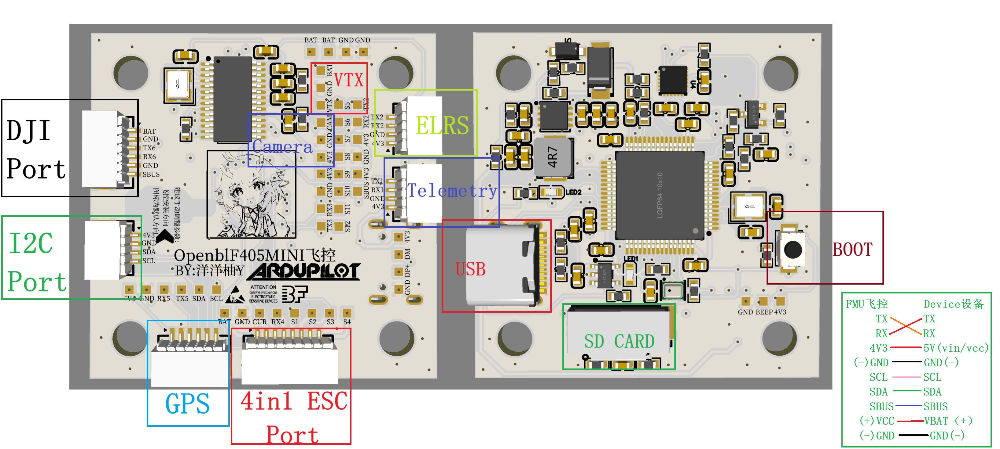
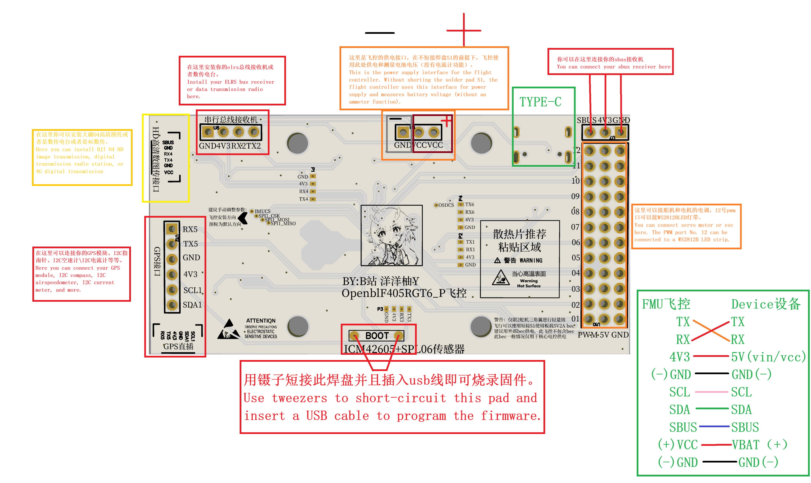
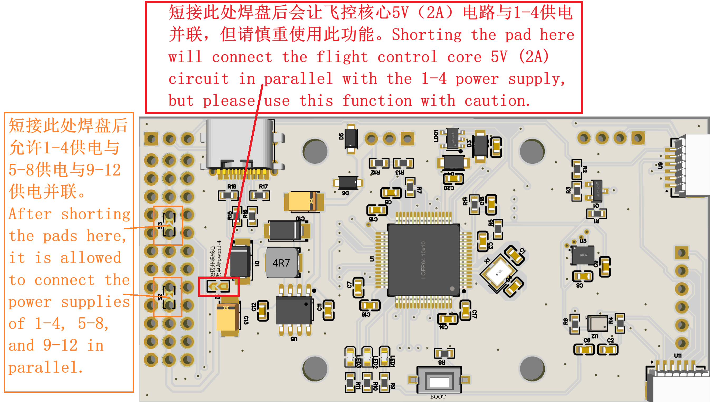

包含一个5v-dcdc（bec），一个大疆高清图传（可拓展4G数传）直插口，sbus接口，elrs接收机接口，gps接口，
icm42605/42688p（mpu6500）加速度计，SPL06（bmp280）气压计，12组PWM输出（支持dshut）。
目前已编译和兼容APM、INAV、BF平台，px4平台代码迁移工作进行中。
考虑到市面上大部分F405固件因为flash阉割功能，本飞控APM固件已支持空速管，光流计（包含测距仪），板载计算机外部激光雷达或视觉定位。
It includes a 5v-dcdc (bec), a DJI high-definition image transmission (expandable to 4G data transmission) direct plug-in port, SBUS interface, ELRS receiver interface, and GPS interface,
ICM42605/42688P (MPU6500) accelerometer, SPL06 (BMP280) barometer, 12 sets of PWM outputs (supporting DSHUT).
Currently, it has been compiled and is compatible with APM, INAV, and BF platforms, with the code migration to the PX4 platform in progress.
Considering that most F405 firmware on the market has been disabled of its flash function, our flight control APM firmware now supports airspeed tubes, optical flow meters (including rangefinders), and external lidar or visual positioning for on-board computers.

请注意，使用APM固件时，如果不使用sbus接收机想要释放uart2号串口用于接elrs接收机或者数传链路设备时，
需要修改参数表BRD_ALT_CONFIG 引脚功能复用值为1（默认为0）来禁用sbus和释放uart为通用模式。
由于没有黑匣子芯片（如果没有安装SD卡）需要设置LOG_BACKEND_TYPE = 0，禁用日志功能。
Please note that when using APM firmware, if you want to free up UART2 serial port for connecting an ELRS receiver or a telemetry link device without using an SBus receiver,
The parameter table BRD_ALT_CONFIG needs to be modified by setting the pin function multiplexing value to 1 (default is 0) to disable SBus and release UART to general-purpose mode.
Due to the absence of a black box chip (if no SD card is installed), it is necessary to set LOG_BACKEND_TYPE = 0 to disable the logging function

PCB_BOM:https://oshwhub.com/yangyangyou/stm32f405_bl_matekf405_te_copy
请注意:此电路板为matekf405_te的改进版本，固件并不兼容。
Please note: This circuit board is an improved version of matekf405_te, and the firmware is not compatible.

PCB_BOM:https://oshwhub.com/yangyangyou/project_qvbuwenu
新增小型化穿越机专用飞控板卡（OpenblF405MINI系列），包含完整OSD、SD卡黑匣子和各种接口（所有接口均按照BF官方接口标准设计），包含大疆高清图传直插x1、GPS直插接口x1、四合一电子调速器直插、
I2C直插（空速管、测距仪）、串口直插x2（推荐elrs+数传电台）
New miniaturized flight controller board for FPV racing drones (OpenblF405MINI series), featuring full OSD, SD card black box, and various interfaces (all designed to BF official interface standards), including DJI HD video transmission direct plug x1, GPS direct plug x1, 4-in-1 ESC direct plug, I2C direct plug (airspeed sensor, rangefinder), serial port direct plug x2 (recommended ELRS + telemetry radio).

OpenblF405MINI

OpenblF405RGT6

代号说明Code Identifier Guide:
RGT6:40mmx80mm
MINI：40mmx40mm
(None)：mpu6500+bmp280
M：mpu6500+spl06
P：icm42605+spl06

如何快速入门APM：https://www.bilibili.com/video/BV1DJ7N61E1v

请注意，本设计为GPL3.0开源协议，允许商用，但需要标明原作者（洋洋柚/B站洋洋柚Y），无人机不是儿童玩具，使用时请遵守相关法律法规。
Please note that this design is under the GPL3.0 open-source protocol, which allows commercial use, but requires attribution to the original author (yangyangyou/bilibili 洋洋柚Y), and drones are not children's toys. Please abide by relevant laws and regulations when using it. 

